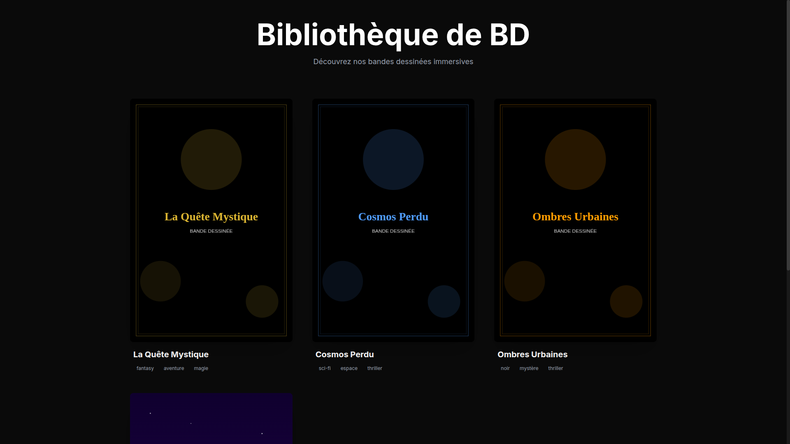
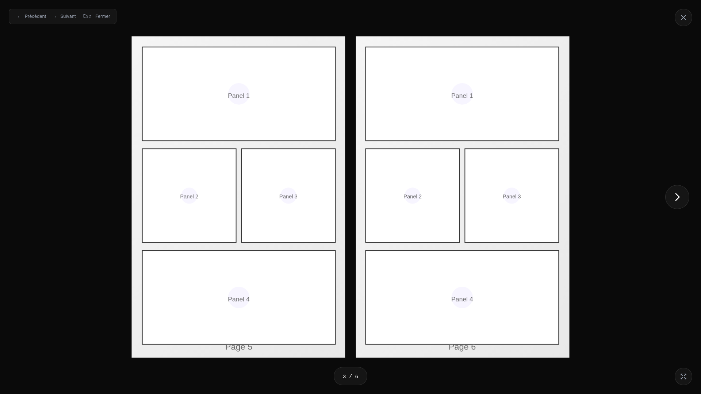
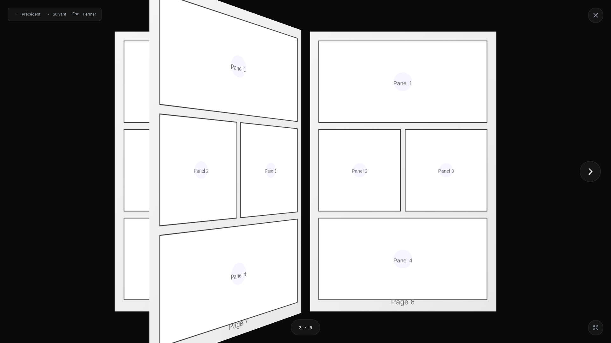

# 📚 Lecteur de BD Immersif

Un lecteur de bandes dessinées web immersif avec effet 3D de tournage de pages réaliste.

## 📸 Screenshots

### Page d'accueil - Galerie de comics


### Lecture de BD - Pages ouvertes


### Animation de tournage de page


## ✨ Fonctionnalités

- 🎨 **Design immersif** avec thème sombre élégant
- 📖 **Effet livre 3D réaliste** avec pages qui tournent physiquement
- 🎯 **Navigation intuitive** : clavier, souris, zones cliquables
- 🖼️ **Galerie de comics** avec couvertures stylisées
- 🔊 **Sons de pages** (page-turn effects)
- 🌐 **Plein écran** pour une expérience immersive totale
- 📱 **Responsive** (optimisé desktop)
- 🎭 **Bordures vintage** style bande dessinée classique
- 📚 **Épaisseur du livre visible** qui change dynamiquement

## 🛠️ Technologies

- **React** 18 - Framework UI
- **Vite** - Build tool ultra-rapide
- **Three.js** + **React Three Fiber** - Rendu 3D
- **Framer Motion** - Animations fluides
- **TailwindCSS v4** - Styling moderne
- **React Hooks** personnalisés pour la logique métier

## 🚀 Installation

```bash
# Installer les dépendances
npm install

# Lancer le serveur de développement
npm run dev

# Builder pour la production
npm run build

# Preview du build de production
npm run preview
```

## 📂 Structure du projet

```
bd/
├── src/
│   ├── components/
│   │   ├── Book.jsx              # Composant principal du livre 3D
│   │   ├── BookPage.jsx          # Page individuelle avec recto/verso
│   │   ├── BookStack.jsx         # Épaisseur visible du livre
│   │   ├── ComicBook.jsx         # Container du lecteur
│   │   ├── ComicGallery.jsx      # Galerie d'accueil
│   │   └── UI/                   # Composants d'interface
│   ├── hooks/
│   │   ├── usePageTurn.js        # Logique de navigation
│   │   ├── useKeyboard.js        # Raccourcis clavier
│   │   └── useAudio.js           # Effets sonores
│   └── data/
│       └── comics.json           # Données des BDs
├── public/
│   └── comics/                   # Images SVG des BDs
└── README.md
```

## 🎮 Contrôles

- **←** / **→** : Page précédente / suivante
- **Espace** : Page suivante
- **Échap** : Fermer le livre
- **F** : Plein écran
- **Clic gauche/droit** : Navigation zones cliquables

## 🎨 Personnalisation

### Ajouter une nouvelle BD

1. Créer un dossier dans `public/comics/[nom-bd]/`
2. Ajouter les images (SVG recommandé)
3. Mettre à jour `src/data/comics.json`:

```json
{
  "id": "nouvelle-bd",
  "title": "Titre de la BD",
  "author": "Auteur",
  "description": "Description...",
  "coverImage": "/comics/nouvelle-bd/cover.svg",
  "pages": [
    {
      "number": 1,
      "image": "/comics/nouvelle-bd/1.svg",
      "alt": "Page 1 description"
    }
  ],
  "totalPages": 6,
  "tags": ["genre1", "genre2"]
}
```

### Modifier les couleurs

Éditer `tailwind.config.js` pour changer les couleurs vintage/accent.

## 📦 Déploiement

### Vercel (Recommandé)

1. Push le code sur GitHub
2. Aller sur [vercel.com](https://vercel.com)
3. Importer le projet
4. Déployer (automatique)

### Netlify

1. Push le code sur GitHub
2. Aller sur [netlify.com](https://netlify.com)
3. Importer le projet
4. Build settings: `npm run build`, output: `dist`

### Manuel

```bash
npm run build
# Upload le dossier dist/ sur votre hébergeur
```

## 🏗️ Architecture technique

### Système de pages

- **Spreads** : Affichage par paire de pages (comme un vrai livre)
- **Rotation physique** : Pages pivotent sur l'axe de la reliure
- **Z-indexing** : Gestion de l'ordre des pages (dessus/dessous)
- **Animation** : 1 seconde avec easing pour fluidité

### Optimisations

- ✅ Cache de textures Three.js
- ✅ Lazy loading des composants
- ✅ Limitation des pages rendues dans les stacks (max 100)
- ✅ Pas de tone mapping pour performance

## 📝 Crédits

Développé avec ❤️ par Claude Code

## 📄 Licence

Projet personnel - Utilisation libre
